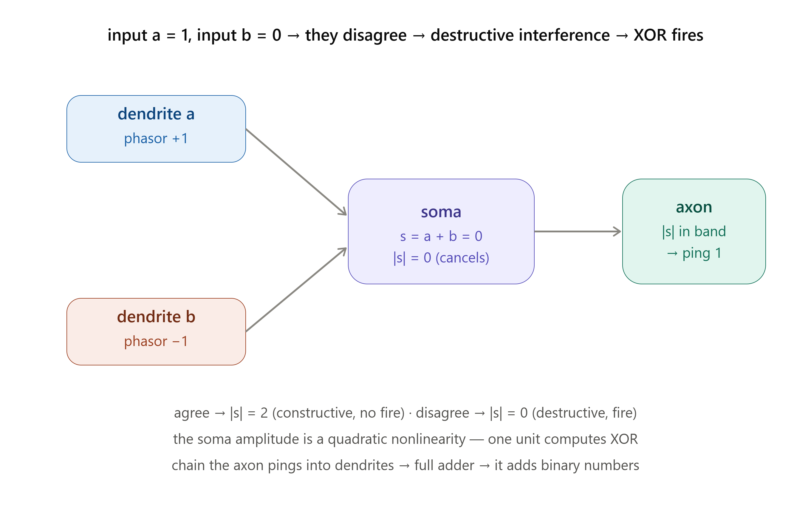

# The Resonator Computer



### A working arithmetic unit built from Berglund-geometry neurons — interference somas and threshold axons

**PerceptionLab / Antti Luode, with Claude. Helsinki, June 2026.**

> Do not hype. Do not lie. Just show.

---

## What this repo became

It started as one question — *can a network of interference resonators
actually compute?* — and the answer turned out to be yes: a single resonator
unit computes XOR, the units compose into a full adder, and the adder adds a
thousand random numbers correctly. That original result is unchanged and
still below (§0–§7).

But the repo kept going. The `V11` through `V18` folders are a continuous
research arc that took the original idea apart and rebuilt it from the
geometry up — through the real wave PDE, through a hard wall, through four
failed attempts at one thing, into a working brain-grounded mechanism, and
all the way to a complete arithmetic unit running as a continuous physical
field you can watch compute. Several of the "next builds" this README
originally *predicted* (§7) got done in that arc, and a few of them came back
with the **opposite** of the hoped-for answer. Those reversals are the most
valuable thing here, so they get their own section: **§8, what the arc
actually taught**, written after living through all of it.

If you only read one new thing, read §8. If you want to watch the final
result run, open `v18/field_timeline.png` — that is the whole eighteen-folder
journey in one picture: a carry being built in time, one excitable spike
triggering the next, with no scheduler anywhere.

---

## 0. The claim, and its proof

Inspired by Nils Berglund's angled-cavity resonator rings (a central cavity fed
by skewed satellite cavities), this repo asks a sharp, falsifiable question:
**can a network of interference resonators with threshold axons actually
compute?** Not resonate prettily — *compute*, in the sense that a screensaver
cannot.

The proof is arithmetic. We build one neuron type, show a single unit computes
**XOR** (the function a scalar McCulloch-Pitts neuron provably cannot, because it
is not linearly separable), compose units through axon→dendrite pings into a
**1-bit full adder**, chain those into an **N-bit ripple-carry adder**, and add
a thousand random numbers. Every result is checked exactly, with the real
damped-oscillator dynamics, not just the algebra.

```
full adder (1-bit)        : 8/8 truth-table rows exact, dynamical resonators
ripple adder (8-bit)      : 1000/1000 random additions correct (algebraic)
ripple adder (8-bit)      : 60/60 random additions correct (real settling)
theta-gamma clocked add   : 13 + 7 = 20, carry rippling one bit per theta cycle
```

A network whose only primitive is a resonator's interference amplitude adds
binary numbers. That is the whole result.

---

## 1. The neuron, mapped to the geometry

Berglund's ring → the unit, term for term:

| Berglund cavity | our unit | role |
|---|---|---|
| angled satellite cavities | dendrites | carry a PHASE from upstream |
| central cavity | soma | MIXES the dendrites by interference |
| (added) | axon | theta-gated threshold: PINGS downstream when \|soma\| crosses a band |
| the *angling* of the cavities | skew coupling among dendrites | directed circulation (chirality), our `skew_core` A |

The computational primitive is the soma's **resonance amplitude**:

```
encode:  bit 0 -> +1,  bit 1 -> -1        (a phasor on the unit circle)
soma:    s = sum_j w_j p_j + bias          (p_j = upstream phasors)
output:  bit = 1  iff  lo <= |s| <= hi      (an amplitude BAND)
```

`|s|` is **constructive** when inputs agree and **destructive** when they
disagree. Because `|s|` is a *quadratic* (nonlinear) function of the inputs,
a single unit carves a nonlinear decision boundary — which is exactly why one
unit computes XOR. A scalar threshold on a linear sum cannot. (Single
complex/phasor neurons solving XOR is an established result in complex-valued
neural-network theory; what this repo adds is that it falls out of the
resonator's *physical* amplitude readout and that the units **compose** into
arithmetic.)

---

## 2. The physics computes the algebra

`resonator_neuron.py` provides two paths and shows they agree:

- `settle_dynamical()` — a real damped, driven oscillator network: each dendrite
  envelope tracks its drive, the soma integrates the weighted dendrites, the
  whole thing rings down to steady state. Skew coupling adds directed
  circulation among dendrites (the angled cavities).
- `settle_algebraic()` — the fixed point of those same ODEs, `s* = Σ w_j p_j + bias`.

With skew = 0 they match to machine precision (`|s|` = 2.000 / 0.000 on the XOR
rows). The antisymmetric skew coupling preserves the destructive-interference
zeros, so the directed resonator computes the same function — chirality without
breaking the logic. **The physics is not a metaphor for the computation; it
performs it.**

---

## 3. The gate set (each gate = one resonator unit)

`gates.py` — XOR, XNOR, AND, OR, NAND, NOR, NOT, every truth table verified
exactly, algebraically and dynamically. AND/OR/NOT are linearly separable
(a biased one-sided band realizes them); XOR/XNOR need the amplitude band's
nonlinearity. The set is functionally complete, so any Boolean function is
reachable by composition.

## 4. Composition = arithmetic

`adder.py` — the axon of one unit re-encodes its output bit as a phasor and
drives the next unit's dendrite. `Sum = A⊕B⊕Cin`, `Cout = AB + Cin(A⊕B)`, each
⊕/·/+ a resonator. Chain full adders LSB→MSB for the ripple-carry adder.

`theta_gamma_clock()` runs it on an explicit schedule: each gate settles within
a **gamma** burst; the **theta** cycle latches stage outputs and advances the
carry one stage per cycle.

## 5. Files (original core)

```
resonator_neuron.py    the unit: dendrites -> interference soma -> threshold axon
gates.py               XOR XNOR AND OR NAND NOR NOT, all truth tables verified
adder.py               full adder, ripple-carry N-bit adder, theta-gamma clock
resonator_alu_demo.py  live tkinter view: watch it add two numbers, gate by gate
```

```bash
python resonator_neuron.py        # physics == algebra, one unit computes XOR
python gates.py                   # every gate truth table (algebraic + dynamical)
python adder.py                   # full adder + 1000 random adds + theta-gamma trace
python resonator_alu_demo.py      # watch the network add, live
```

---

## 6. Ledger (original core)

**Verified in code:** a single resonator unit computes XOR; the damped-oscillator
dynamics settle to the algebraic fixed point exactly; a functionally complete
gate set; a 1-bit full adder (8/8); an 8-bit ripple adder (1000/1000 algebraic,
60/60 dynamical); a theta-gamma clock carrying the addition stage by stage.

**Built-in, not emergent:** the per-gate weights, biases, and bands are *chosen*
to realize each truth table — a designed computer, not a learned one.

**Kept in the drawer (inspiration, not claim):** that this is how cortex does
arithmetic; computation = memory = physics as a metaphysical identity. What is
shown is narrower and solid: a complete, clocked logic family from one
interference primitive.

---

## 7. The next builds (as originally predicted)

> *These were the four directions this README predicted. Two of them got built
> in the V11–V18 arc, and what they returned is in §8. Left here unedited as
> the honest record of what we expected before doing it.*

1. **Learned gates.** Let a unit *learn* its weights and band from examples.
2. **Sequence machine.** Theta-gamma clock + skew coupling to store and replay
   a temporal pattern.
3. **Phase-richer encoding.** Full unit circle for multi-valued arithmetic.
4. **Berglund-faithful field version.** Replace the lumped ODE with an actual
   2-D wave field on the angled-cavity geometry, reading the computation off the
   standing-wave amplitude.

---

## 8. What the arc actually taught (V11–V18)

*This section is the honest part — the things eighteen folders of building
turned up that the optimistic framing above did not see coming. It is written
looking back over the whole run. Each item is a real result with a folder
behind it, and several are the opposite of what we hoped.*

**The biggest single lesson: every nice story had a wall, and the walls were
more informative than the stories.** Four times in this arc, an idea that
sounded clearly true turned out to be false when actually tested, and each
falsification taught more than a confirmation would have. That pattern — not
any one result — is what I'd want a reader to take away.

**(V11) Geometry buys you *parity*, and then it stops.** Dendrite *length*
alone — just routing the cable longer or shorter — retunes a unit between XOR
and XNOR for free, no weight change. That is real and lovely. But it is
*parity-complete, not Boolean-complete*: no length, no attenuation, no
two-cable arrangement ever yields AND/OR. Those need a *bias*, which is a
property of the soma, not the cable — and a bias can be grown geometrically
too, but only by adding a structurally different element (an always-on
dendrite). The clean lesson: **geometry gives you one axis of logic for free
and charges you a second, different mechanism for the rest.** "Length is
logic" is true, but only half of logic.

**(V12) The clean wall was not clean once the real wave equation ran.** The
original §7.4 prediction — do it as a real 2-D wave field — got built, and the
core mechanism *survived* (matched lengths still give destructive interference,
exactly). But the crisp picture the lumped model promised — a sharp
quarter-wavelength instability, a clean cosine — *did not* survive. A real
dendrite channel, once it is not short compared to a wavelength, is **its own
resonant cavity**, not a one-way delay line. It reflects. The lumped model had
no term for that. Doing the honest physics made the result messier and more
real at the same time: the wall exists, but its shape is set by the channel's
own resonances, not a tidy formula.

**(V13) Nothing passive flows one way.** We
tried four times to make a signal go in a preferred direction using geometry —
a skewed angle, a periodic AIS-like lattice, a threshold relay, a refractory
chain. **All four failed**, to five decimal places. A passive, linear,
time-reversal-symmetric medium *cannot* prefer a direction, no matter how you
shape it. This was four straight negative results, and it was the most useful
folder in the whole arc, because it killed the seductive "the angled geometry
already gives directed flow" story dead, and pointed at what was actually
needed.

**(V14) Directionality is not geometry — it is an active, history-dependent
mechanism, and the brain literally has it.** Reading Leterrier's 2018 paper on
the axon initial segment gave the answer V13 was missing: directionality comes
from *spike origination at a high-excitability site* plus *inactivation*
(genuine between-timestep state) plus a *channel-density gradient*. Built as a
real excitable medium (FitzHugh–Nagumo), it works — a spike runs forward into
the axon ~10× farther than it leaks back into the dendrite — and a control with
the gradient removed is symmetric, proving the gradient does the work. The
lesson that reframes the whole project: **computation and direction are
*different physical mechanisms*.** The geometry computes; the excitable
dynamics give direction. Conflating them (which the early enthusiasm did) was
the error. Keeping them distinct is what makes the rest work.

**(V15–V16) The two halves marry, and the marriage has a seam with a name.**
The interference soma (static amplitude) and the excitable axon (transient
threshold) speak different languages, and joining them *needs a comparator* —
a clean band-membership → fixed-kick interface. With it, all six gates survive
being read out as directional spikes, the unit composes, and it scales to a
full adder and a multi-bit ripple adder carried entirely by spikes. And the
timing is not free: concurrency revealed that **latency equals logic depth** —
the carry must physically travel, ~460 ticks per spike-hop. That delay is the
structural reason a real brain needs a clock to stage arithmetic. The
theta-gamma clock §4 *assumed* was, here, *forced* by the physics.

**(V17) The carry is a literal travelling wave.** A fully concurrent multi-bit
adder, all stages live at once, computes correctly — and its worst-case latency
is *dead linear* in word width (~921 ticks/bit), because the carry physically
walks the word one stage at a time. A control (sums fire but no carry ripples)
stays flat in width, proving the linear growth is specifically the carry
rippling. Ripple-carry's textbook O(N) is here a real spike crossing real
distance.

**(V18) Remove the last bit of bookkeeping and the field demands a synapse.**
The heaviest build: throw out the scheduler entirely, make everything one
continuous field under one update rule. It *broke* — and broke informatively.
A propagating spike is *transient*: it passes the output point and is gone, but
a logic signal must be *held*. The fix is a **capture/latch** at each gate's
output — which is exactly what a real synapse does (it captures the spike into a
sustained postsynaptic signal, it does not pass voltage through). The field
*demanded* the synapse, by necessity, not analogy. With it, the adder computes
as a real continuous field, and you can watch the carry get built in time, one
excitable spike triggering the next (`v18/field_timeline.png`,
`v18/field_adder.gif`).

**The through-line, stated once:** this project found, the hard way, that a
neuron is (at least) **two different machines wearing one coat** — an
interference computer (geometry, phase, the soma) and a directional excitable
conductor (active channels, inactivation, the axon) — joined by a capture
element (the synapse) that the physics will not let you skip. The original repo
built the first machine. The arc discovered, by hitting walls, that the other
two are not optional decorations on it but *separate necessary mechanisms*, and
then built and married all three into something that computes arithmetic as a
watchable physical field. None of this proves the brain works this way. What it
proves is narrower and, to me, more interesting: **if you take the geometry
seriously and refuse to lie about the walls, the geometry itself tells you what
else a neuron has to be.**

---

## 9. Folder map

```
resonator_neuron.py, gates.py, adder.py, resonator_alu_demo.py
                        the original core (§0–§7): one interference primitive -> arithmetic
Geometric Neuron V11/   length is parity-complete, not Boolean-complete; bias needs a 2nd mechanism
V12/                    the parity result on the real 2-D wave PDE; channels resonate, walls blur
(V13)                   [not in repo] four failed attempts to make passive geometry flow one way
v14/                    directionality done right: excitable origination + inactivation (Leterrier)
V15/                    the marriage: interference soma + directional axon = one complete unit
v16/                    scaling to arithmetic; latency = logic depth
v17/                    fully concurrent ripple adder; carry latency linear in word width
v18/                    no scheduler — a continuous field — which forces the synapse (a capture latch)
                        + live visualizations of the field computing
```

Each folder has its own `PAPER.md` (the full argument and every number) and,
from V12 on, a `README.md` map. The papers carry an honest ledger separating
what is verified in code from what is analogy or speculation.

---

*Helsinki, June 2026. The angled cavities turned out to be a gate. Wire enough
of them and they add — but making them add **directionally**, as a real field,
turned out to require two more machines the geometry alone never had: an active
excitable conductor and a synapse to catch the spike. The brain may or may not
work this way. But if you follow the interference honestly and let every wall
correct you, the math keeps handing you the next piece of a neuron. Do not
hype. Do not lie. Just show.*
